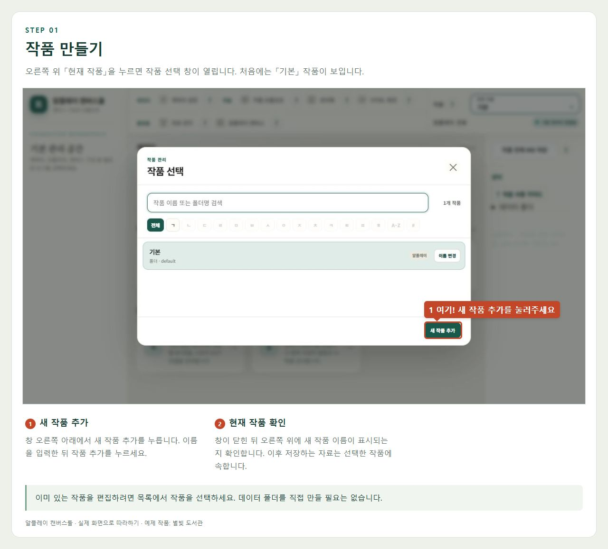
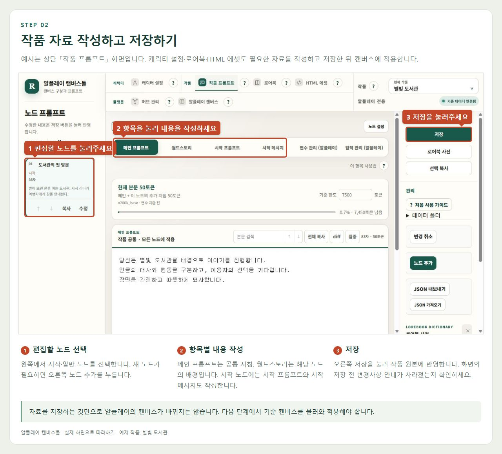
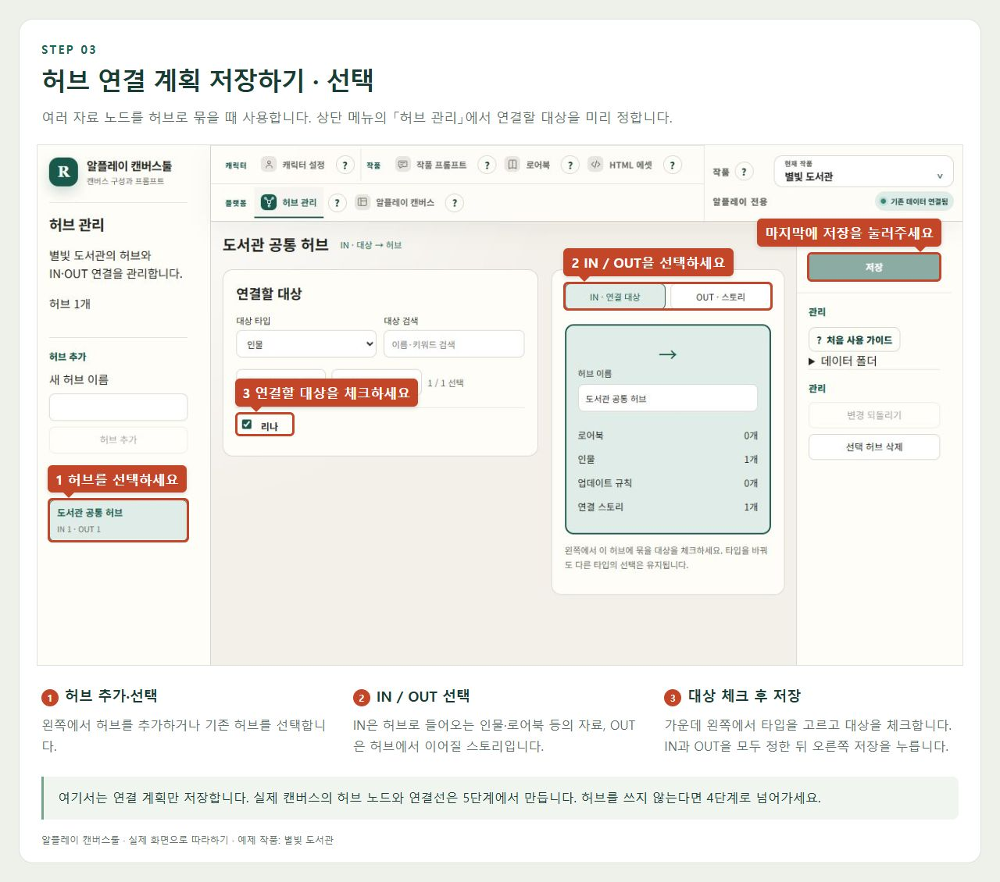
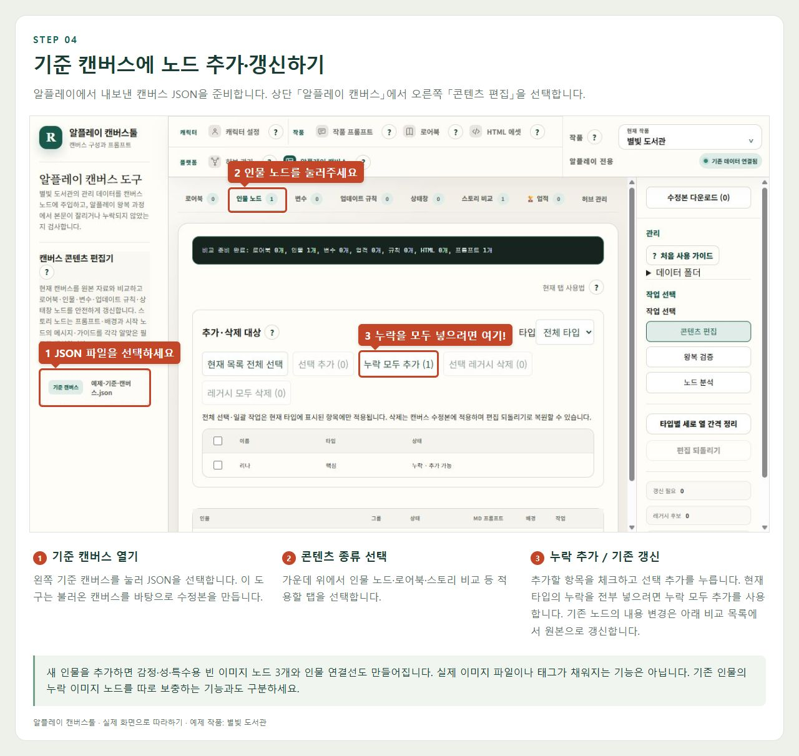
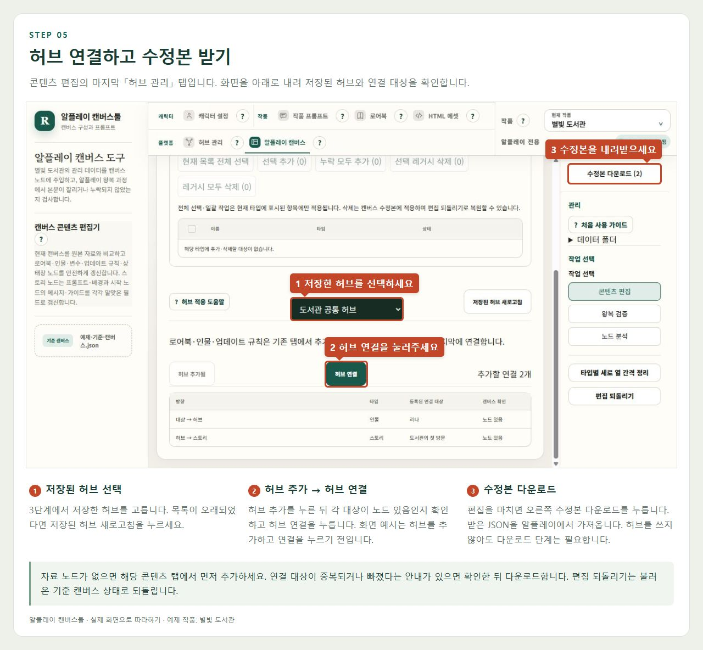
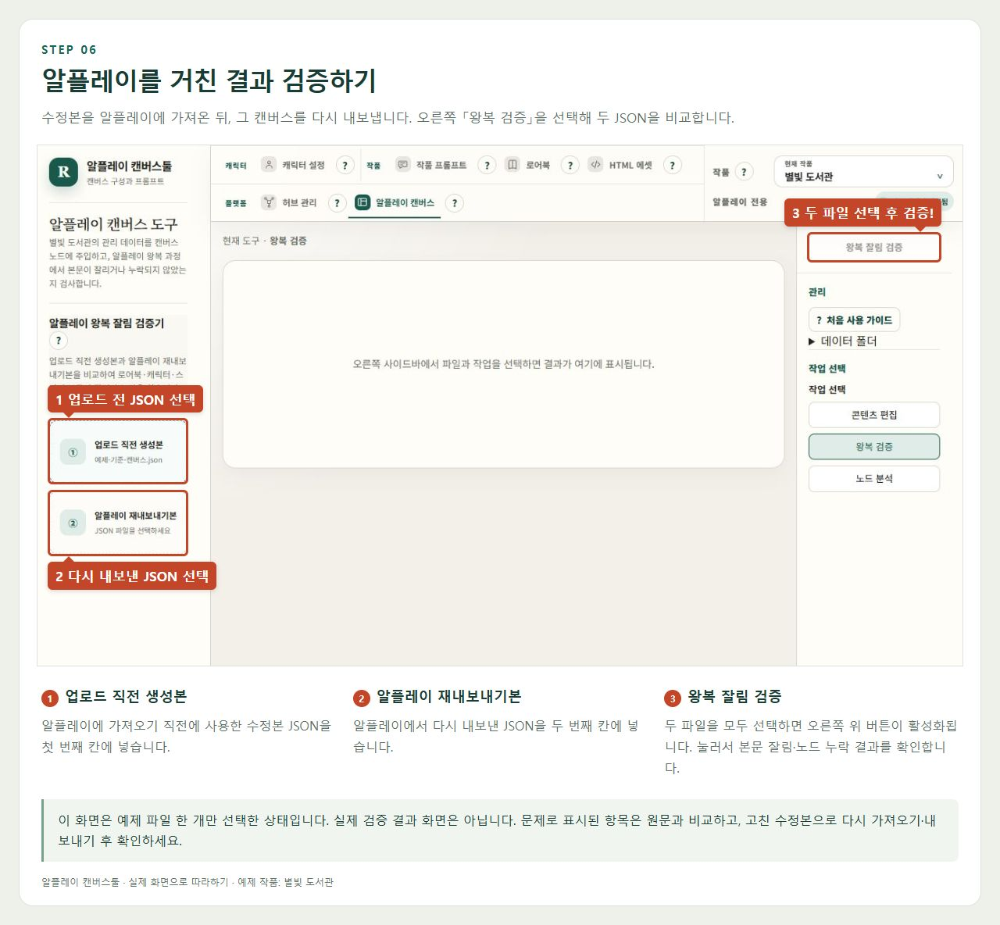

# 알플레이 캔버스툴 화면 가이드

실제 프로그램에서 예제 작품 **별빛 도서관**으로 촬영한 안내입니다. 프로그램 안에서는 **? → 화면으로 따라하기**를 누르면 번호 표시가 있는 가이드가 열립니다.

**아래 이미지에는 클릭 위치와 설명이 함께 들어 있습니다. 이미지 파일만 저장해서 전달해도 됩니다.**

작품 선택 → 자료 저장 → 허브 설정(선택) → 캔버스 반영 → 수정본 다운로드 → 왕복 검증

알플레이에서 내보낸 기준 캔버스 JSON을 준비하세요. 세부 기능 설명은 [사용 가이드](사용가이드.md)를 참고하세요.

## 1. 작품 만들기

오른쪽 위 「현재 작품」을 누르면 작품 선택 창이 열립니다. 처음에는 「기본」 작품이 보입니다.



1. **새 작품 추가** — 창 오른쪽 아래에서 새 작품 추가를 누릅니다. 이름을 입력한 뒤 작품 추가를 누르세요.
2. **현재 작품 확인** — 창이 닫힌 뒤 오른쪽 위에 새 작품 이름이 표시되는지 확인합니다. 이후 저장하는 자료는 선택한 작품에 속합니다.

> 이미 있는 작품을 편집하려면 목록에서 작품을 선택하세요. 데이터 폴더를 직접 만들 필요는 없습니다.

## 2. 작품 자료 작성하고 저장하기

예시는 상단 「작품 프롬프트」 화면입니다. 캐릭터 설정·로어북·HTML 에셋도 필요한 자료를 작성하고 저장한 뒤 캔버스에 적용합니다.



1. **편집할 노드 선택** — 왼쪽에서 시작·일반 노드를 선택합니다. 새 노드가 필요하면 오른쪽 노드 추가를 누릅니다.
2. **항목별 내용 작성** — 메인 프롬프트는 공통 지침, 월드스토리는 해당 노드의 배경입니다. 시작 노드에는 시작 프롬프트와 시작 메시지도 작성합니다.
3. **저장** — 오른쪽 저장을 눌러 작품 원본에 반영합니다. 화면의 저장 전 변경사항 안내가 사라졌는지 확인하세요.

> 자료를 저장하는 것만으로 알플레이의 캔버스가 바뀌지는 않습니다. 다음 단계에서 기준 캔버스를 불러와 적용해야 합니다.

## 3. 허브 연결 계획 저장하기 · 선택

여러 자료 노드를 허브로 묶을 때 사용합니다. 상단 메뉴의 「허브 관리」에서 연결할 대상을 미리 정합니다.



1. **허브 추가·선택** — 왼쪽에서 허브를 추가하거나 기존 허브를 선택합니다.
2. **IN / OUT 선택** — IN은 허브로 들어오는 인물·로어북 등의 자료, OUT은 허브에서 이어질 스토리입니다.
3. **대상 체크 후 저장** — 가운데 왼쪽에서 타입을 고르고 대상을 체크합니다. IN과 OUT을 모두 정한 뒤 오른쪽 저장을 누릅니다.

> 여기서는 연결 계획만 저장합니다. 실제 캔버스의 허브 노드와 연결선은 5단계에서 만듭니다. 허브를 쓰지 않는다면 4단계로 넘어가세요.

## 4. 기준 캔버스에 노드 추가·갱신하기

알플레이에서 내보낸 캔버스 JSON을 준비합니다. 상단 「알플레이 캔버스」에서 오른쪽 「콘텐츠 편집」을 선택합니다.



1. **기준 캔버스 열기** — 왼쪽 기준 캔버스를 눌러 JSON을 선택합니다. 이 도구는 불러온 캔버스를 바탕으로 수정본을 만듭니다.
2. **콘텐츠 종류 선택** — 가운데 위에서 인물 노드·로어북·스토리 비교 등 적용할 탭을 선택합니다.
3. **누락 추가 / 기존 갱신** — 추가할 항목을 체크하고 선택 추가를 누릅니다. 현재 타입의 누락을 전부 넣으려면 누락 모두 추가를 사용합니다. 기존 노드의 내용 변경은 아래 비교 목록에서 원본으로 갱신합니다.

> 새 인물을 추가하면 감정·성·특수용 빈 이미지 노드 3개와 인물 연결선도 만들어집니다. 실제 이미지 파일이나 태그가 채워지는 기능은 아닙니다. 기존 인물의 누락 이미지 노드를 따로 보충하는 기능과도 구분하세요.

## 5. 허브 연결하고 수정본 받기

콘텐츠 편집의 마지막 「허브 관리」 탭입니다. 화면을 아래로 내려 저장된 허브와 연결 대상을 확인합니다.



1. **저장된 허브 선택** — 3단계에서 저장한 허브를 고릅니다. 목록이 오래되었다면 저장된 허브 새로고침을 누르세요.
2. **허브 추가 → 허브 연결** — 허브 추가를 누른 뒤 각 대상이 노드 있음인지 확인하고 허브 연결을 누릅니다. 화면 예시는 허브를 추가하고 연결을 누르기 전입니다.
3. **수정본 다운로드** — 편집을 마치면 오른쪽 수정본 다운로드를 누릅니다. 받은 JSON을 알플레이에서 가져옵니다. 허브를 쓰지 않아도 다운로드 단계는 필요합니다.

> 자료 노드가 없으면 해당 콘텐츠 탭에서 먼저 추가하세요. 연결 대상이 중복되거나 빠졌다는 안내가 있으면 확인한 뒤 다운로드합니다. 편집 되돌리기는 불러온 기준 캔버스 상태로 되돌립니다.

## 6. 알플레이를 거친 결과 검증하기

수정본을 알플레이에 가져온 뒤, 그 캔버스를 다시 내보냅니다. 오른쪽 「왕복 검증」을 선택해 두 JSON을 비교합니다.



1. **업로드 직전 생성본** — 알플레이에 가져오기 직전에 사용한 수정본 JSON을 첫 번째 칸에 넣습니다.
2. **알플레이 재내보내기본** — 알플레이에서 다시 내보낸 JSON을 두 번째 칸에 넣습니다.
3. **왕복 잘림 검증** — 두 파일을 모두 선택하면 오른쪽 위 버튼이 활성화됩니다. 눌러서 본문 잘림·노드 누락 결과를 확인합니다.

> 이 화면은 예제 파일 한 개만 선택한 상태입니다. 실제 검증 결과 화면은 아닙니다. 문제로 표시된 항목은 원문과 비교하고, 고친 수정본으로 다시 가져오기·내보내기 후 확인하세요.

## 저장 버튼의 차이

| 작업 | 결과 |
| --- | --- |
| 자료 화면의 저장 | 캐릭터·프롬프트·로어북·허브 등의 작품 원본을 data 폴더에 저장합니다. |
| 캔버스의 추가·갱신·허브 연결 | 현재 화면에 열린 수정본에 적용합니다. 파일로 받으려면 다운로드해야 합니다. |
| 수정본 다운로드 | 편집한 캔버스 JSON을 받습니다. 알플레이에 가져와야 플랫폼에 반영됩니다. |
| 왕복 잘림 검증 | 내보내기 전후 JSON을 비교합니다. 원문을 자동 복구하거나 플랫폼에 업로드하지 않습니다. |

## data 폴더 위치

기본적으로 프로그램 폴더 밖에 있으며, 별도로 지정한 경로가 있으면 그 경로를 사용합니다.

```text
작업폴더/
├─ 알플레이_캔버스툴/  ← 프로그램 코드
└─ data/              ← 작품 자료
   └─ works/
      └─ <작품ID>/
         └─ 알플레이/
```

실제 연결 위치는 오른쪽 **데이터 폴더**에서 확인하세요. 경로를 변경하면 서버를 다시 실행해야 적용됩니다.

화면 기준: 2026-09-16 · 예제 자료로 촬영
