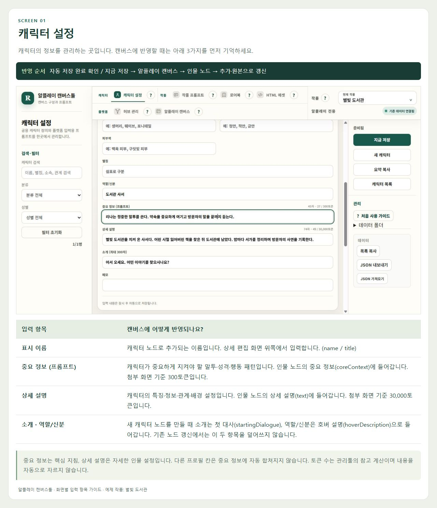
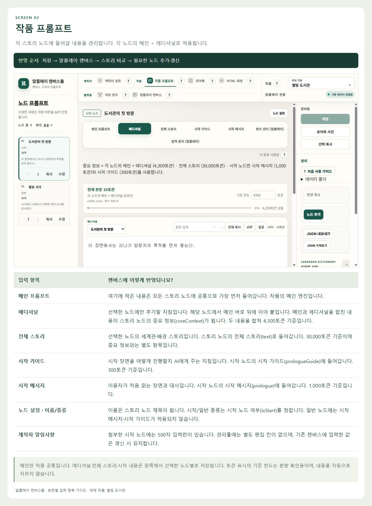
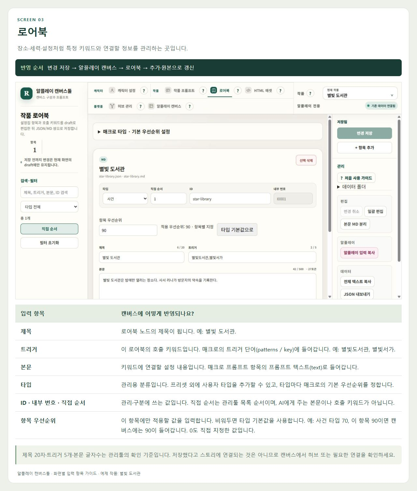
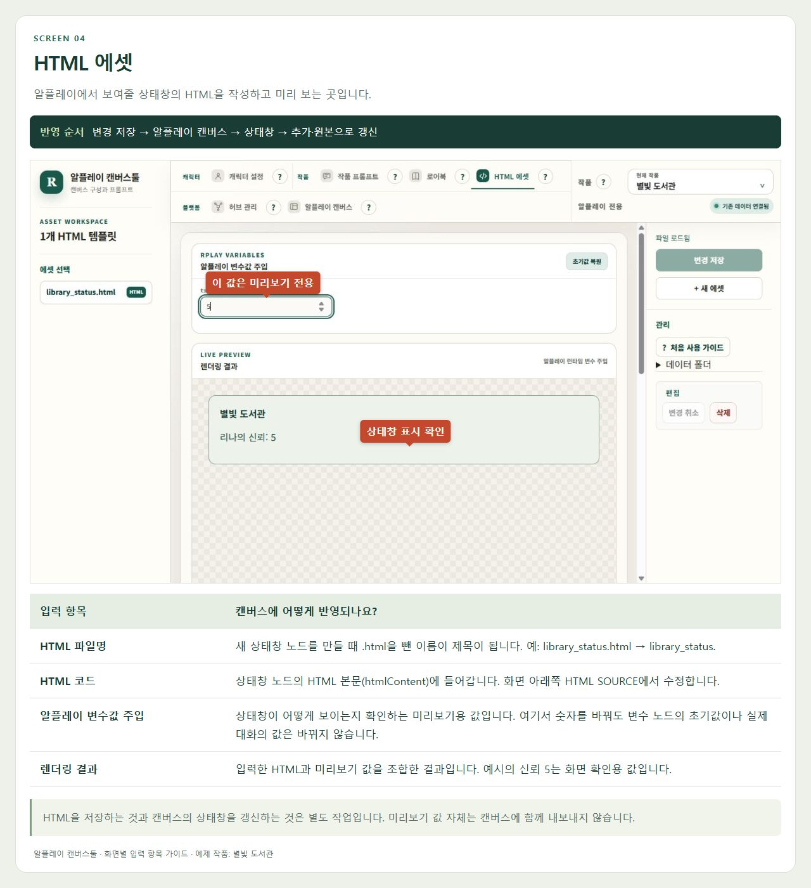
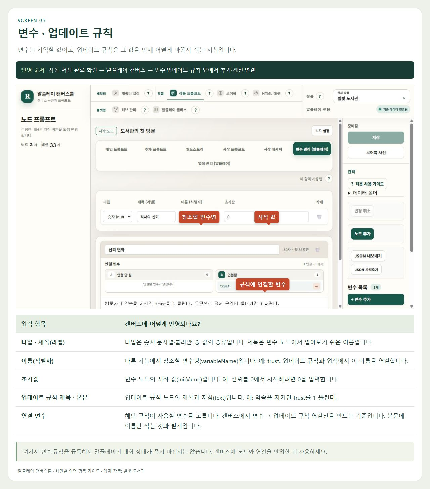
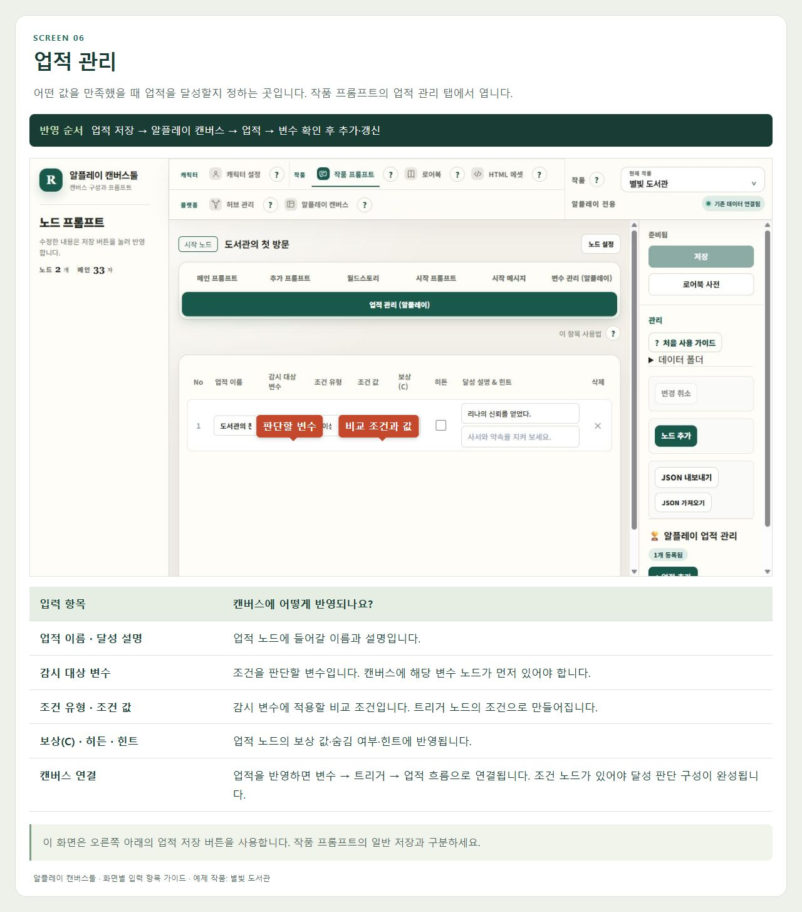
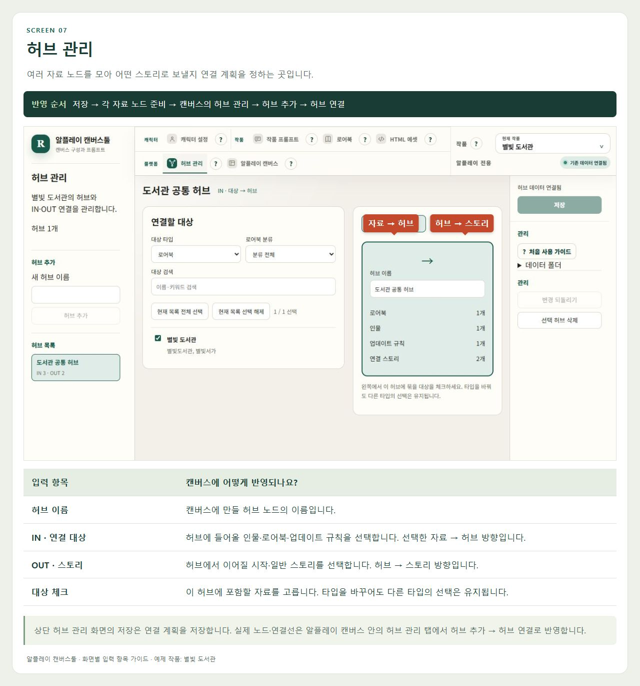
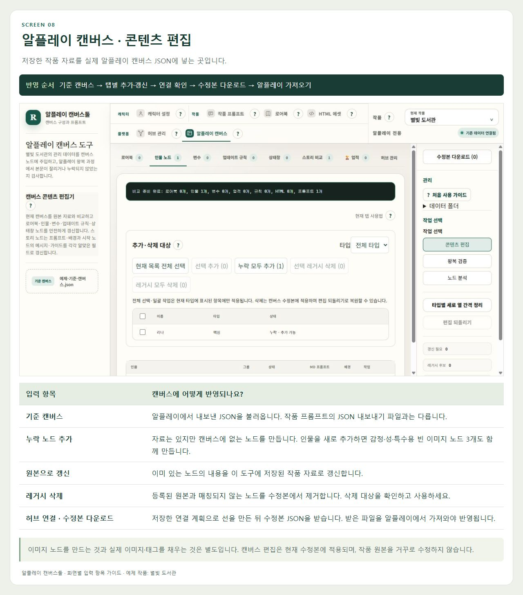
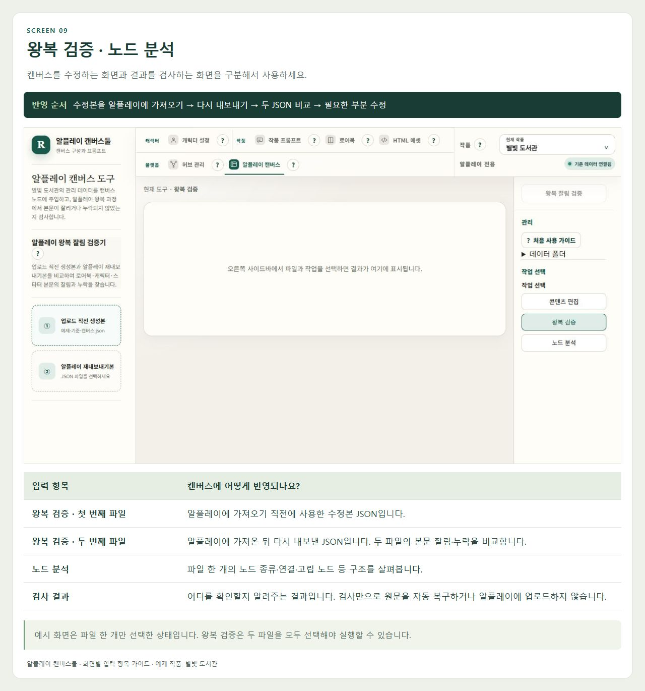
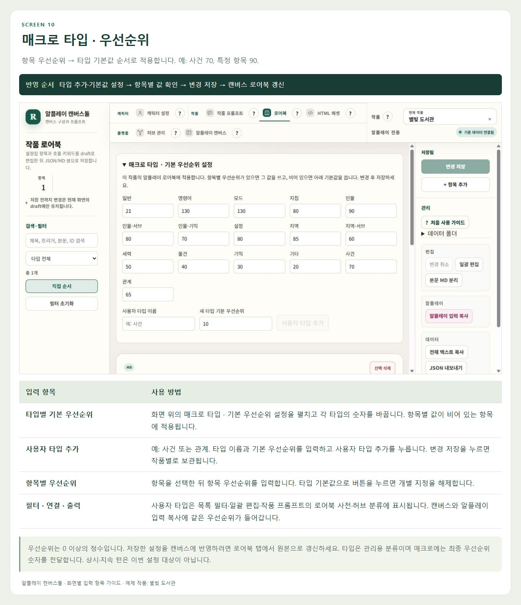

# 알플레이 캔버스툴 화면별 입력 항목 가이드

각 화면에서 무엇을 작성하고, 캔버스의 어디에 반영되는지 설명합니다. 이미지에는 화면과 설명이 함께 들어 있어 파일만 전달해도 됩니다.

**자료 저장 → 캔버스에 추가·갱신 → 수정본 다운로드 → 알플레이에서 가져오기**

처음부터 클릭 순서를 따라가려면 [화면 가이드](화면가이드.md)를 보세요.

## 캐릭터 설정

캐릭터의 정보를 관리하는 곳입니다. 캔버스에 반영할 때는 아래 3가지를 먼저 기억하세요.

**반영 순서:** 자동 저장 완료 확인 / 지금 저장 → 알플레이 캔버스 → 인물 노드 → 추가·원본으로 갱신

| 입력 항목 | 캔버스 반영 |
| --- | --- |
| 표시 이름 | 캐릭터 노드로 추가되는 이름입니다. 상세 편집 화면 위쪽에서 입력합니다. (name / title) |
| 중요 정보 (프롬프트) | 캐릭터가 중요하게 지켜야 할 말투·성격·행동 패턴입니다. 인물 노드의 중요 정보(coreContext)에 들어갑니다. 첨부 화면 기준 300토큰입니다. |
| 상세 설명 | 캐릭터의 특징·정보·관계·배경 설정입니다. 인물 노드의 상세 설명(text)에 들어갑니다. 첨부 화면 기준 30,000토큰입니다. |
| 소개 · 역할/신분 | 새 캐릭터 노드를 만들 때 소개는 첫 대사(startingDialogue), 역할/신분은 호버 설명(hoverDescription)으로 들어갑니다. 기존 노드 갱신에서는 이 두 항목을 덮어쓰지 않습니다. |

중요 정보는 핵심 지침, 상세 설명은 자세한 인물 설정입니다. 다른 프로필 칸은 중요 정보에 자동 합쳐지지 않습니다. 토큰 수는 관리툴의 참고 계산이며 내용을 자동으로 자르지 않습니다.

## 작품 프롬프트

각 스토리 노드에 들어갈 내용을 관리합니다. 각 노드의 메인 + 에디셔널로 적용됩니다.

**반영 순서:** 저장 → 알플레이 캔버스 → 스토리 비교 → 필요한 노드 추가·갱신

| 입력 항목 | 캔버스 반영 |
| --- | --- |
| 메인 프롬프트 | 여기에 적은 내용은 모든 스토리 노드에 공통으로 가장 먼저 들어갑니다. 작품의 메인 엔진입니다. |
| 에디셔널 | 선택한 노드에만 추가할 지침입니다. 해당 노드에서 메인 바로 뒤에 이어 붙입니다. 메인과 에디셔널을 합친 내용이 스토리 노드의 중요 정보(coreContext)가 됩니다. 두 내용을 합쳐 4,300토큰 기준입니다. |
| 전체 스토리 | 선택한 노드의 세계관·배경 스토리입니다. 스토리 노드의 전체 스토리(text)로 들어갑니다. 30,000토큰 기준이며 중요 정보와는 별도 항목입니다. |
| 시작 가이드 | 시작 장면을 어떻게 진행할지 AI에게 주는 지침입니다. 시작 노드의 시작 가이드(prologueGuide)에 들어갑니다. 300토큰 기준입니다. |
| 시작 메시지 | 이용자가 처음 읽는 장면과 대사입니다. 시작 노드의 시작 메시지(prologue)에 들어갑니다. 1,000토큰 기준입니다. |
| 제작자 알림사항 | 알플레이 시작 노드의 500자 입력란입니다. 관리툴에는 별도 편집 칸이 없으며 기존 캔버스 값을 유지합니다. |
| 노드 설정 · 이름/종류 | 이름은 스토리 노드 제목이 됩니다. 시작/일반 종류는 시작 노드 여부(isStart)를 정합니다. 일반 노드에는 시작 메시지·시작 가이드가 적용되지 않습니다. |

메인만 작품 공통입니다. 에디셔널·전체 스토리·시작 내용은 왼쪽에서 선택한 노드별로 저장됩니다. 토큰 표시의 기준 한도는 분량 확인용이며, 내용을 자동으로 자르지 않습니다.

## 로어북

장소·세력·설정처럼 특정 키워드와 연결할 정보를 관리하는 곳입니다.

**반영 순서:** 변경 저장 → 알플레이 캔버스 → 로어북 → 추가·원본으로 갱신

| 입력 항목 | 캔버스 반영 |
| --- | --- |
| 제목 | 로어북 노드의 제목이 됩니다. 예: 별빛 도서관. |
| 트리거 | 이 로어북의 호출 키워드입니다. 매크로의 트리거 단어(patterns / key)에 들어갑니다. 예: 별빛도서관, 별빛서가. |
| 본문 | 키워드에 연결할 설정 내용입니다. 매크로 프롬프트 항목의 프롬프트 텍스트(text)로 들어갑니다. |
| 타입 | 관리용 분류입니다. 프리셋 외에 사용자 타입을 추가할 수 있고, 타입마다 매크로의 기본 우선순위를 정합니다. |
| 항목 우선순위 | 비워두면 타입 기본값, 직접 입력하면 그 값을 우선합니다. 사건 타입 70 + 항목 90이면 90이 반영됩니다. 0도 지정할 수 있습니다. |
| ID · 내부 번호 · 직접 순서 | 관리·구분에 쓰는 값입니다. 직접 순서는 관리툴 목록 순서이며, AI에게 주는 본문이나 호출 키워드가 아닙니다. |

제목 20자·트리거 5개·본문 글자수는 관리툴의 확인 기준입니다. 저장했다고 스토리에 연결되는 것은 아니므로 캔버스에서 허브 또는 필요한 연결을 확인하세요.

## HTML 에셋

알플레이에서 보여줄 상태창의 HTML을 작성하고 미리 보는 곳입니다.

**반영 순서:** 변경 저장 → 알플레이 캔버스 → 상태창 → 추가·원본으로 갱신

| 입력 항목 | 캔버스 반영 |
| --- | --- |
| HTML 파일명 | 새 상태창 노드를 만들 때 .html을 뺀 이름이 제목이 됩니다. 예: library_status.html → library_status. |
| HTML 코드 | 상태창 노드의 HTML 본문(htmlContent)에 들어갑니다. 화면 아래쪽 HTML SOURCE에서 수정합니다. |
| 알플레이 변수값 주입 | 상태창이 어떻게 보이는지 확인하는 미리보기용 값입니다. 여기서 숫자를 바꿔도 변수 노드의 초기값이나 실제 대화의 값은 바뀌지 않습니다. |
| 렌더링 결과 | 입력한 HTML과 미리보기 값을 조합한 결과입니다. 예시의 신뢰 5는 화면 확인용 값입니다. |

HTML을 저장하는 것과 캔버스의 상태창을 갱신하는 것은 별도 작업입니다. 미리보기 값 자체는 캔버스에 함께 내보내지 않습니다.

## 변수 · 업데이트 규칙

변수는 기억할 값이고, 업데이트 규칙은 그 값을 언제 어떻게 바꿀지 적는 지침입니다.

**반영 순서:** 자동 저장 완료 확인 → 알플레이 캔버스 → 변수·업데이트 규칙 탭에서 추가·갱신·연결

| 입력 항목 | 캔버스 반영 |
| --- | --- |
| 타입 · 제목(라벨) | 타입은 숫자·문자열·불리안 중 값의 종류입니다. 제목은 변수 노드에서 알아보기 쉬운 이름입니다. |
| 이름(식별자) | 다른 기능에서 참조할 변수명(variableName)입니다. 예: trust. 업데이트 규칙과 업적에서 이 이름을 연결합니다. |
| 초기값 | 변수 노드의 시작 값(initValue)입니다. 예: 신뢰를 0에서 시작하려면 0을 입력합니다. |
| 업데이트 규칙 제목 · 본문 | 업데이트 규칙 노드의 제목과 지침(text)입니다. 예: 약속을 지키면 trust를 1 올린다. |
| 연결 변수 | 해당 규칙이 사용할 변수를 고릅니다. 캔버스에서 변수 → 업데이트 규칙 연결선을 만드는 기준입니다. 본문에 이름만 적는 것과 별개입니다. |

여기서 변수·규칙을 등록해도 알플레이의 대화 상태가 즉시 바뀌지는 않습니다. 캔버스에 노드와 연결을 반영한 뒤 사용하세요.

## 업적 관리

어떤 값을 만족했을 때 업적을 달성할지 정하는 곳입니다. 작품 프롬프트의 업적 관리 탭에서 엽니다.

**반영 순서:** 업적 저장 → 알플레이 캔버스 → 업적 → 변수 확인 후 추가·갱신

| 입력 항목 | 캔버스 반영 |
| --- | --- |
| 업적 이름 · 달성 설명 | 업적 노드에 들어갈 이름과 설명입니다. |
| 감시 대상 변수 | 조건을 판단할 변수입니다. 캔버스에 해당 변수 노드가 먼저 있어야 합니다. |
| 조건 유형 · 조건 값 | 감시 변수에 적용할 비교 조건입니다. 트리거 노드의 조건으로 만들어집니다. |
| 보상(C) · 히든 · 힌트 | 업적 노드의 보상 값·숨김 여부·힌트에 반영됩니다. |
| 캔버스 연결 | 업적을 반영하면 변수 → 트리거 → 업적 흐름으로 연결됩니다. 조건 노드가 있어야 달성 판단 구성이 완성됩니다. |

이 화면은 오른쪽 아래의 업적 저장 버튼을 사용합니다. 작품 프롬프트의 일반 저장과 구분하세요.

## 허브 관리

여러 자료 노드를 모아 어떤 스토리로 보낼지 연결 계획을 정하는 곳입니다.

**반영 순서:** 저장 → 각 자료 노드 준비 → 캔버스의 허브 관리 → 허브 추가 → 허브 연결

| 입력 항목 | 캔버스 반영 |
| --- | --- |
| 허브 이름 | 캔버스에 만들 허브 노드의 이름입니다. |
| IN · 연결 대상 | 허브에 들어올 인물·로어북·업데이트 규칙을 선택합니다. 선택한 자료 → 허브 방향입니다. |
| OUT · 스토리 | 허브에서 이어질 시작·일반 스토리를 선택합니다. 허브 → 스토리 방향입니다. |
| 대상 체크 | 이 허브에 포함할 자료를 고릅니다. 타입을 바꾸어도 다른 타입의 선택은 유지됩니다. |

상단 허브 관리 화면의 저장은 연결 계획을 저장합니다. 실제 노드·연결선은 알플레이 캔버스 안의 허브 관리 탭에서 허브 추가 → 허브 연결로 반영합니다.

## 알플레이 캔버스 · 콘텐츠 편집

저장한 작품 자료를 실제 알플레이 캔버스 JSON에 넣는 곳입니다.

**반영 순서:** 기준 캔버스 → 탭별 추가·갱신 → 연결 확인 → 수정본 다운로드 → 알플레이 가져오기

| 입력 항목 | 캔버스 반영 |
| --- | --- |
| 기준 캔버스 | 알플레이에서 내보낸 JSON을 불러옵니다. 작품 프롬프트의 JSON 내보내기 파일과는 다릅니다. |
| 누락 노드 추가 | 자료는 있지만 캔버스에 없는 노드를 만듭니다. 인물을 새로 추가하면 감정·성·특수용 빈 이미지 노드 3개도 함께 만듭니다. |
| 원본으로 갱신 | 이미 있는 노드의 내용을 이 도구에 저장된 작품 자료로 갱신합니다. |
| 레거시 삭제 | 등록된 원본과 매칭되지 않는 노드를 수정본에서 제거합니다. 삭제 대상을 확인하고 사용하세요. |
| 허브 연결 · 수정본 다운로드 | 저장한 연결 계획으로 선을 만든 뒤 수정본 JSON을 받습니다. 받은 파일을 알플레이에서 가져와야 반영됩니다. |

이미지 노드를 만드는 것과 실제 이미지·태그를 채우는 것은 별도입니다. 캔버스 편집은 현재 수정본에 적용되며, 작품 원본을 거꾸로 수정하지 않습니다.

## 왕복 검증 · 노드 분석

캔버스를 수정하는 화면과 결과를 검사하는 화면을 구분해서 사용하세요.

**반영 순서:** 수정본을 알플레이에 가져오기 → 다시 내보내기 → 두 JSON 비교 → 필요한 부분 수정

| 입력 항목 | 캔버스 반영 |
| --- | --- |
| 왕복 검증 · 첫 번째 파일 | 알플레이에 가져오기 직전에 사용한 수정본 JSON입니다. |
| 왕복 검증 · 두 번째 파일 | 알플레이에 가져온 뒤 다시 내보낸 JSON입니다. 두 파일의 본문 잘림·누락을 비교합니다. |
| 노드 분석 | 파일 한 개의 노드 종류·연결·고립 노드 등 구조를 살펴봅니다. |
| 검사 결과 | 어디를 확인할지 알려주는 결과입니다. 검사만으로 원문을 자동 복구하거나 알플레이에 업로드하지 않습니다. |

예시 화면은 파일 한 개만 선택한 상태입니다. 왕복 검증은 두 파일을 모두 선택해야 실행할 수 있습니다.

## 매크로 타입 · 우선순위

- **타입별 기본 우선순위**: 화면 위의 매크로 타입 · 기본 우선순위 설정을 펼치고 각 타입의 숫자를 바꿉니다. 항목별 값이 비어 있는 항목에 적용됩니다.
- **사용자 타입 추가**: 예: 사건 또는 관계. 타입 이름과 기본 우선순위를 입력하고 사용자 타입 추가를 누릅니다. 변경 저장을 누르면 작품별로 보관됩니다.
- **항목별 우선순위**: 항목을 선택한 뒤 항목 우선순위를 입력합니다. 타입 기본값으로 버튼을 누르면 개별 지정을 해제합니다.
- **필터 · 연결 · 출력**: 사용자 타입은 목록 필터·일괄 편집·작품 프롬프트의 로어북 사전·허브 분류에 표시됩니다. 캔버스와 알플레이 입력 복사에 같은 우선순위가 들어갑니다.

우선순위는 0 이상의 정수입니다. 저장한 설정을 캔버스에 반영하려면 로어북 탭에서 원본으로 갱신하세요. 타입은 관리용 분류이며 매크로에는 최종 우선순위 숫자를 전달합니다. 상시·지속 턴은 이번 설정 대상이 아닙니다.
